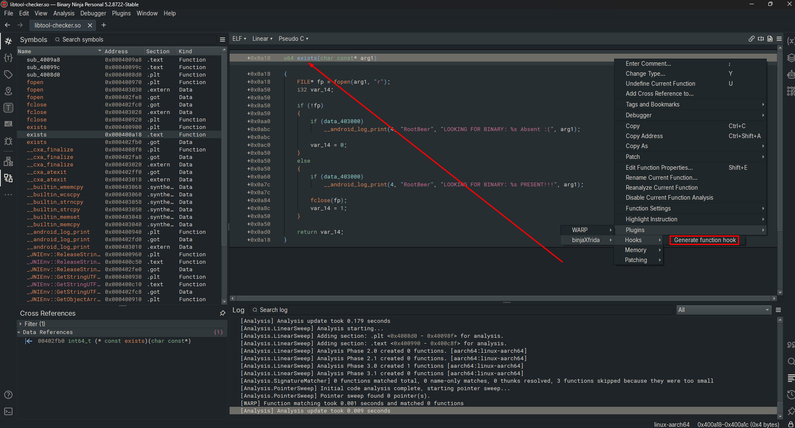
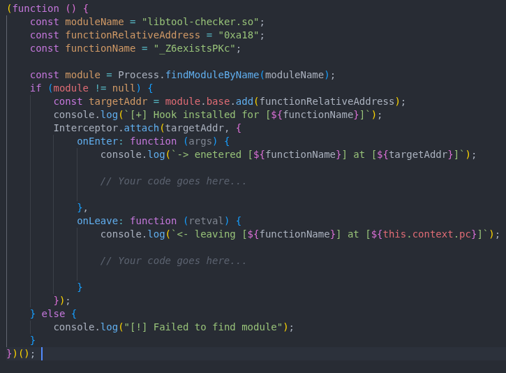
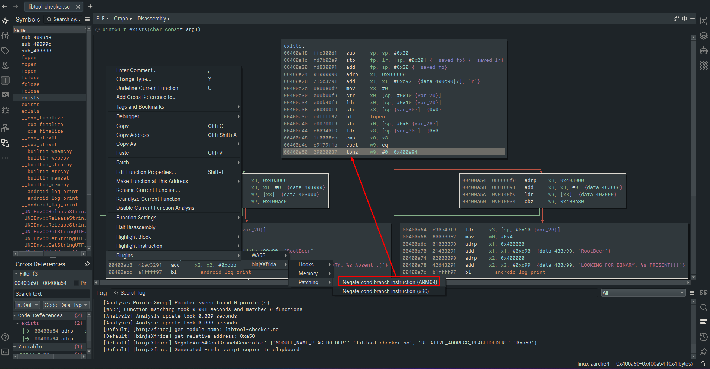
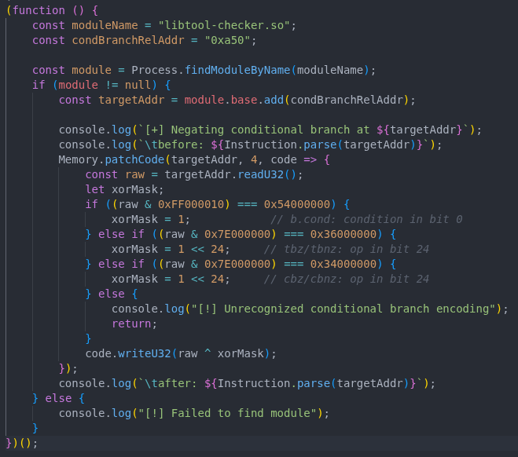

<div align="center">


# binjaXfrida

**Generate Frida scripts directly from Binary Ninja.** ⚡

[](https://github.com/noobexon1/binjaXfrida/releases)
[](https://github.com/noobexon1/binjaXfrida/stargazers)
[](https://github.com/noobexon1/binjaXfrida/commits)
[](https://github.com/noobexon1/binjaXfrida/issues)
[](https://github.com/noobexon1/binjaXfrida/releases)
[](https://github.com/noobexon1/binjaXfrida/actions/workflows/release.yml)


[](https://github.com/noobexon1/binjaXfrida/releases)
[](https://github.com/noobexon1/binjaXfrida)
[](LICENSE)

</div>

**🎣 Function Hook**
<table>
  <tr>
    <td width="50%"></td>
    <td width="50%"></td>
  </tr>
</table>

**🔀 Negate Conditional Branch**
<table>
  <tr>
    <td width="50%"></td>
    <td width="50%"></td>
  </tr>
</table>

## ✨ Features

Right-click in Binary Ninja to generate ready-to-use Frida snippets.

- 🧩 **Composable scripts** — snippets are independent but can be nested to build complex instrumentation with a few clicks
- 🎯 **Context-aware** — scripts can auto-fill module name, function address, and really any other details that can be aquired from your current Binja context
- 📋 **Clipboard integration** — generated scripts are instantly copied to your clipboard

### Supported Actions

#### 🪝 Hooks

| Action | Description |
|---|---|
| Generate function hook | Intercept calls to the selected function, log entry/exit |
| Generate dlopen hooks | Monitor `dlopen` (including Android variants) to detect module loading |

#### 🧠 Memory

| Action | Description |
|---|---|
| Modify section protection | Change memory protection of the section at the current address |

#### 🩹 Patching

| Action | Description |
|---|---|
| Negate cond branch (ARM64) | Flip the condition of an ARM64 conditional branch |
| Negate cond branch (x86/x64) | Flip the condition of an x86/x64 conditional branch |

## 🔧 How it Works

Each feature follows a simple pipeline: a **Frida template** (`templates/`) provides the JavaScript skeleton with placeholders, an **action** (`actions/`) gathers context from Binary Ninja (function name, address, module), and a **generator** (`core/`) fills the template to produce the final script. UI concerns like clipboard live in `ui/`.

## 📦 Installation

**From release:**

1. Find your plugins directory:
    ```python
    binaryninja.user_plugin_path()
    ```
2. Download the latest [release](https://github.com/noobexon1/binjaXfrida/releases) and extract into the plugins directory.
3. Restart Binary Ninja.

**From source:**

Clone:

```Shell
git clone https://github.com/noobexon1/binjaXfrida.git
cd binjaXfrida
```
🪟 Windows:

```powershell
.\dev\install.ps1
```

🐧 Linux:

```Shell
./dev/install.sh
```

## 🚀 Usage

1. Open your target binary in Binary Ninja.
2. Right-click in the Disassembly, Pseudocode, or Functions view.
3. Navigate to **Plugins** → **binjaXfrida** → choose a category and action.
4. The generated Frida script is printed to the Output window and copied to your clipboard.
5. Paste into your Frida CLI, agent, or `.js` file.

### 🧱 Script Composition

Snippets are designed to be independent building blocks. You can nest scripts inside each other — for example, hook a function, negate a conditional branch on entry, and restore it on exit. Complex instrumentation from a few clicks.

## 🤝 Contributing

Contributions welcome! Got a useful Frida snippet? Turn it into a template so everyone can use it.

1. Fork the repository.
2. Create a new branch for your feature or fix.
3. Make your changes.
4. Submit a pull request.

| Adding... | Where |
|---|---|
| New Frida snippet | `templates/` (JS template) + `core/` (generator) + `actions/` (action) |
| UI element | `ui/` |

JS templates must be wrapped in a self-invoking function so they remain composable (see existing templates for the pattern).

Each action and generator lives in its own file — easy to contribute without merge conflicts.

## 🗺️ Roadmap

See [open issues](https://github.com/noobexon1/binjaXfrida/issues) for planned features and known bugs.

## 📄 License

[MIT](LICENSE)
